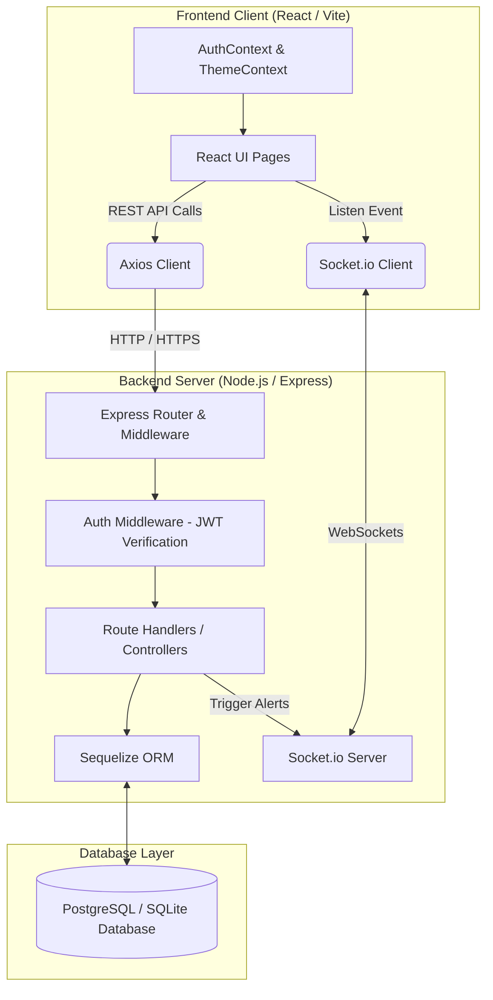
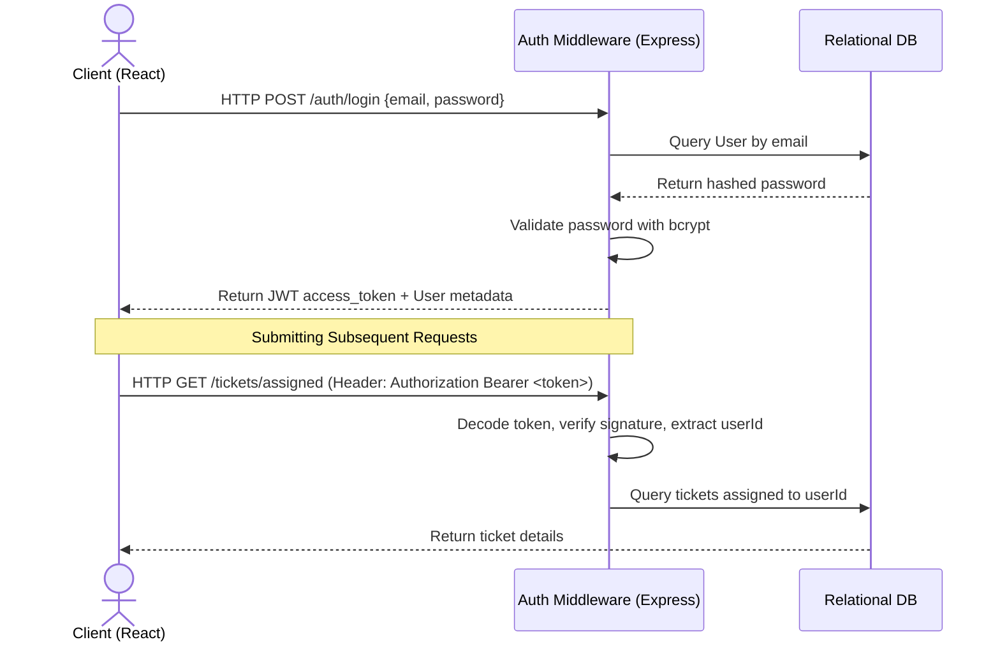
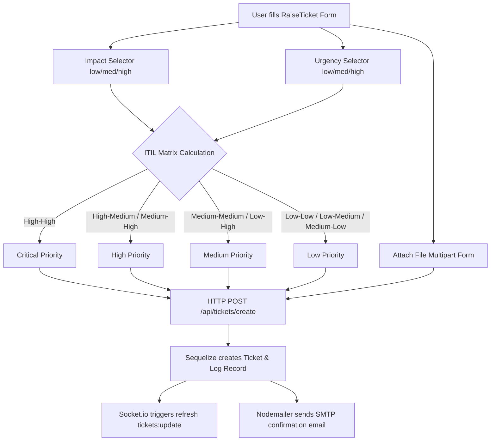

# System Architecture: ServiceNow ITIL Support Desk

This document provides a comprehensive analysis of the system architecture, design patterns, technology stack, directory structures, and data flows of the ServiceNow-aligned ITIL Support Desk platform.

---

## 🌟 Architecture Overview

The platform is designed as a decoupled, real-time client-server application adhering to modern SPA (Single Page Application) and RESTful API architectural styles, with real-time push capabilities.



---

## 🛠️ Technology Stack

| Layer | Technology | Purpose |
| :--- | :--- | :--- |
| **Frontend Core** | React 19, Vite 8, ES Modules | High-performance Client rendering, fast hot-reloading dev environment. |
| **Styling** | Vanilla CSS, Framer Motion, Lucide | Slick, responsive ServiceNow dark/light UI styles, premium animations, rich micro-interactions. |
| **Routing** | React Router v7 | Seamless client-side SPA routing, Private Route guards, parameter mapping. |
| **Real-time** | Socket.io-client | Live push notifications for incident updates, comment streams, and support alerts. |
| **Analytics** | Recharts | Interactive SVG analytics, weekly activity dashboards, metrics rendering. |
| **Backend Core** | Node.js, Express | Highly-scalable async event-driven HTTP REST Server. |
| **Database ORM** | Sequelize | Promise-based Node.js ORM mapping relational schemas to models. |
| **Real-time Engine**| Socket.io | Bi-directional WebSocket communication manager. |
| **Security** | JWT (jsonwebtoken), bcryptjs | State-free secure user sessions, secure password hashing. |
| **Mailing** | Nodemailer | Automatic transactional SMTP email alerts on ticket creation or resolution. |

---

## 📂 Project Directory Structure

```
p:/remote_sushmitha
├── backend/                  # Express REST Backend
│   ├── src/
│   │   ├── config/           # Database Connection Configuration
│   │   │   └── database.js
│   │   ├── controllers/      # Route Controller Handlers (Auth, Admin, Tickets)
│   │   │   ├── adminController.js
│   │   │   ├── authController.js
│   │   │   └── ticketController.js
│   │   ├── middleware/       # Express Custom Middlewares (JWT Authentication)
│   │   │   └── auth.js
│   │   ├── models/           # Relational Sequelize Schemas (Unified index.js)
│   │   │   └── index.js
│   │   ├── routes/           # REST API Endpoint Declarations
│   │   │   ├── admin.js
│   │   │   ├── auth.js
│   │   │   ├── notifications.js
│   │   │   └── tickets.js
│   │   └── index.js          # Server Entrypoint (Express, Socket.io, SMTP setup)
│   ├── uploads/              # Multipart File Upload Storage
│   └── package.json
│
├── frontend/                 # React Client Application
│   ├── src/
│   │   ├── assets/           # Dynamic Logos, Vectors, Icons
│   │   ├── components/       # Core Layout Frameworks
│   │   │   ├── Navbar.jsx    # Top Public Branding Navbar
│   │   │   └── ServiceNowLayout.jsx # Collapsible module sidebar, header & breadcrumbs
│   │   ├── context/          # React Context States
│   │   │   ├── AuthContext.jsx # JWT management, user roles, state-wide login
│   │   │   └── ThemeContext.jsx # Vanilla CSS theme toggle state provider
│   │   ├── pages/            # View Pages
│   │   │   ├── Home.jsx      # Public Catalog landing and search page
│   │   │   ├── Login.jsx     # Corporate authentication portal
│   │   │   ├── Register.jsx  # Employee enrollment portal
│   │   │   ├── Dashboard.jsx # Employee KPI Analytics & Weekly Recharts
│   │   │   ├── RaiseTicket.jsx # ServiceNow 2-column Incident form
│   │   │   ├── MyTickets.jsx # Interactive Ticket catalog and chat comments stream
│   │   │   ├── Profile.jsx   # Employee Profile form and Active Work dashboard
│   │   │   └── AdminPanel.jsx # ITIL Admin Control center (Kanban, Users, Drawer)
│   │   ├── services/         # API Layer Integrations
│   │   │   ├── api.js        # Global Axios Client with interceptors
│   │   │   └── socket.js     # Single-instance Socket.io Client
│   │   ├── App.css
│   │   ├── index.css         # Styling system tokens, classes & variables
│   │   ├── App.jsx           # Client Route definitions & Route Protection guards
│   │   └── main.jsx
│   └── package.json
```

---

## 🔐 Security & Access Control Model

Authentication is built using a stateless JSON Web Token (JWT) scheme.



### Route Protection Guards
In `App.jsx`, paths are protected using the wrapper component `<PrivateRoute>`:
* **Authentication Guard**: Verifies if the user context is loaded; redirects to `/login` if null.
* **Employee Profiling Guard**: Verifies if `employee_id`, `alternate_email`, or `phone` is missing in the user context; if so, forces redirect to `/profile` to ensure compliance.
* **Role Guard (Admin Only)**: Restricts `/admin` paths exclusively to users with role `admin`; redirects standard employees to `/dashboard`.

---

## 🔄 Core Data Flows

### 1. Ticket Submission & Automatic Priority Matrix



### 2. Real-Time Chat & Activity Feed Updates
1. Support Agent posts a **Work Note** (internal comment) or a **Customer Update** on `/admin` drawer.
2. Express backend persists comment in `TicketComment` model.
3. Backend triggers real-time socket emit:
   `io.emit('tickets:update', { event: 'comment_added', ticketId })`
   If client is a user, also emits direct notification socket:
   `io.emit('notification:user_id', { message: 'New reply on ticket ...' })`
4. The client's socket listener in `MyTickets.jsx` or `AdminPanel.jsx` receives the event and immediately fetches comments/details silently, refreshing the chat stream instantly without a page reload.

---

## 📊 Database Schema Relationships (Sequelize)

* **User (1) <---> (N) Ticket**: One user can author multiple tickets (`user_id`).
* **User (1) <---> (N) Ticket (Assigned)**: One support agent can be assigned to multiple tickets (`assigned_staff_id`).
* **Ticket (1) <---> (N) TicketComment**: One ticket has a timeline comments stream (`ticket_id`).
* **Ticket (1) <---> (N) TicketLog**: One ticket logs state modifications, reassignments, and audits (`ticket_id`).
* **Ticket (1) <---> (1) Feedback**: A closed/resolved ticket can contain customer satisfaction survey metrics (`ticket_id`).
* **Category (1) <---> (N) Ticket**: Tickets map to a standardized corporate Category mapping.
* **Category (1) <---> (N) SubCategory**: Standardized ITIL category sub-divisions.
* **User (1) <---> (N) Notification**: User's notification inbox queue.
